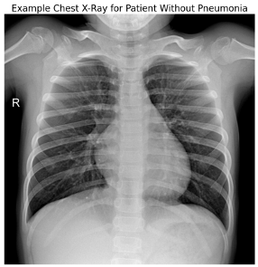
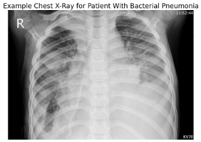
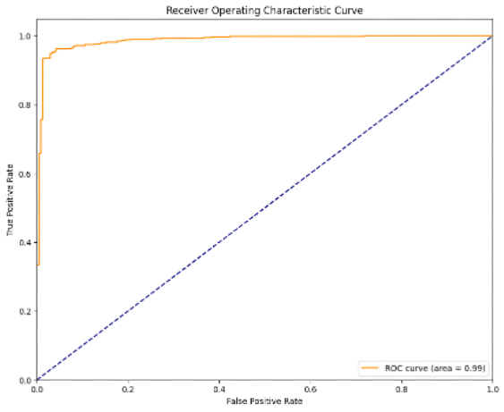
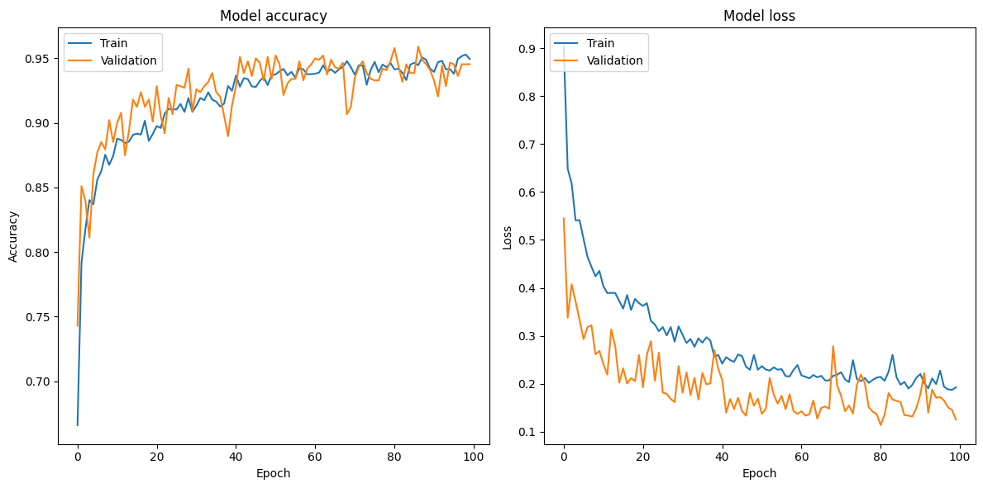
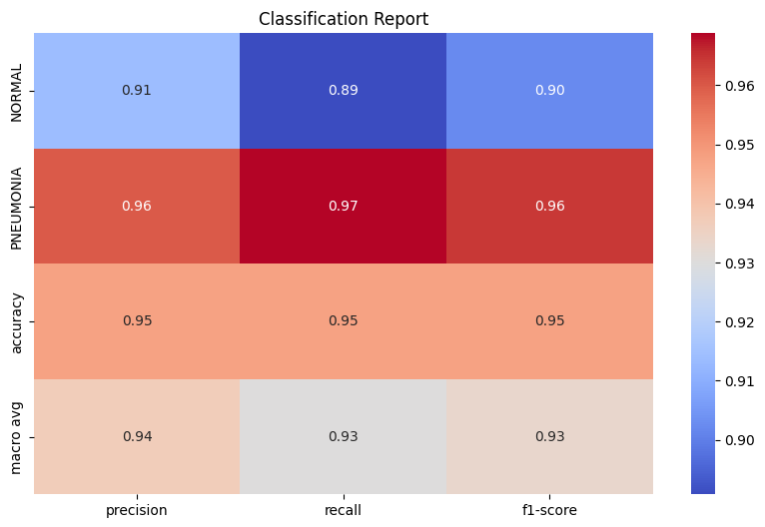
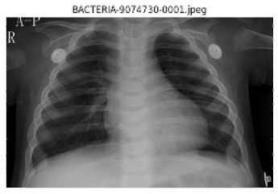

# Applying a Convolutional Neural Network to Pediatric Pneumonia Diagnoses

By Jamie Carnevale

## Pediatric Pneumonia Overview

In 2018, over 800,000 children under the age of 5 died of pneumonia (https://www.unicef.org/reports/every-childs-right-survive-pneumonia-2020) 

Three types of Pneumonia
- Lobar
- Bronchopneumonia (or lobular pneumonia)
- Interstitial (or atypical) pneumonia
  - Interstitial pneumonia is the hardest to detect

## Various studies suggest pneumonia misdiagnoses are a major issue

1. Bada, C., Carreazo, N. Y., Chalco, J. P., & Huicho, L. (2007). Inter-observer agreement in interpreting chest X-rays on children with acute lower respiratory tract infections and concurrent wheezing. Sao Paulo Medical Journal, 125(3), 150-154.
2. Fletcher, E. K., Arkedis, J., Salisbury, T., Redfern, A., Bundala, F., Connor, A., ... & Lee, C. (2021). Correct diagnosis of childhood pneumonia in public facilities in Tanzania: a randomised comparison of diagnostic methods. BMJ Open, 11(5), e042895.
3. Porter, P., Brisbane, J., Tan, J., Bear, N., Choveaux, J., Della, P., & Abeyratne, U. (2021). Diagnostic Errors Are Common in Acute Pediatric Respiratory Disease: A Prospective, Single-Blinded Multicenter Diagnostic Accuracy Study in Australian Emergency Departments. Frontiers in Pediatrics, 9, 736018.
4. Waterer, G. W. (2015). The Diagnosis of Community-acquired Pneumonia. Do We Need to Take a Big Step Backward? American Journal of Respiratory and Critical Care Medicine, 192(8), 912-913.

### quote from Porter et al study
- “We found a substantial error rate in the interpretation of chest x-rays. Only 59% of x-rays with consolidation were correctly diagnosed in E.D., while 14% of normal x-rays were erroneously thought to have consolidation. This error was a significant contributing factor to the poor diagnostic performance for focal (consolidative) pneumonia in our study.” (Porter et al)

## Applying a Convolutional Neural Network to aid in Pediatric Pneumonia Diagnostics!

- While the diagnoses of pneumonia rely on multiple factors, one of the most useful tools is a chest x-ray
- By applying a convolutional neural network to chest x-rays for children with pneumonia and children without pneumonia, we can train a model to find the differences between the two groups
- data: Kermany, Daniel; Zhang, Kang; Goldbaum, Michael (2018), “Large Dataset of Labeled Optical Coherence Tomography (OCT) and Chest X-Ray Images”, Mendeley Data, V3, doi: 10.17632/rscbjbr9sj.3

## Example Training Images

## Best Model

### Confusion Matrix

### ROC_AUC = 0.99

### Not Overfit

### Classification Report

### Example

## Use this Model!

Conclusion:
- pneumonia is often misdiagnosed
- this convolutional neural network does a great job at classifying patients with pneumonia vs no pneumonia
Best use cases
- tool for any doctor (especially those tired and overworked)
- tool for inexperienced doctors
- tool for underfunded medical institutions who might be able to take x-rays but don’t have the doctors to support 
Next steps:
- viral vs bacteria
- model deployment

